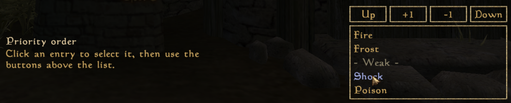

# Bor's Drop-in Utils (OpenMW)

My collection of drop-in modules that can be added to any OpenMW Lua projects for either performance or convenience.

**It's neither a playable mod nor a dependency for something else. It's just a collection of standalone modules for OpenMW Lua API others could add to their projects.**

**Free to use, modify and redistribute. No permissions required, but a mention of the project is appreciated.**

Core premise of this collection is that you can freely drop these lua files in your project and immediately use them. No weird configuration steps, no external dependencies, no bullshit - just `require()` them or register in the correct scope and you're good to go.

I believe that the accessibility of these utilities can and will make community mods better for everyone - developers and users alike.

## Table of Contents

- [Bor's Drop-in Utils (OpenMW)](#bors-drop-in-utils-openmw)
  - [Table of Contents](#table-of-contents)
  - [General Utils](#general-utils)
    - [Settings Cache](#settings-cache)
    - [Hard Dependency Checker](#hard-dependency-checker)
    - [Message Picker](#message-picker)
    - [Yaml Folder Parser](#yaml-folder-parser)
    - [Preset Manager](#preset-manager)
  - [Settings Renderers](#settings-renderers)
    - [Text Set](#text-set)
    - [MultiCheckbox](#multicheckbox)
    - [MultiNumber](#multinumber)
    - [MultiTextLine](#multitextline)
    - [Two Column Set](#two-column-set)
    - [Order List](#order-list)
  - [Other Neat Things](#other-neat-things)
    - [Virtual List](#virtual-list)
    - [Super Settings Renderers](#super-settings-renderers)
  - [Credits](#credits)

## General Utils

### Settings Cache

> Scope: Any

Calling settings getters is expensive, but this cost can be minimized by subscribing to changes, storing all data in tables and querying tables instead. So this is basically a wrapper for your settings that doesn't really differ in interactions, but ultimately saves you performance.

Usage example:

```lua
local async = require("openmw.async")
local storage = require("openmw.storage")

local settingsCache = require("scripts.MyMod.utils.settingsCache")

local settings = settingsCache.new(
    storage.playerSection("SettingsMyMod_mySection"),
    async,
    function(key)
        if key == "someKey" then
            doSomething(settings.someKey)
        end
    end
)

print(settings.someKey)
```

### Hard Dependency Checker

> Scope: Player

This module checks a list of required dependencies and reports any missing plugin, premature interface call (load order issue), or outdated version during player-script initialization or any other early setup step.

When a dependency fails, it prints each problem to the log and shows a generic popup to the user so they can diagnose the issue by themselves.

Usage example:

```lua
local I = require("openmw.interfaces")

local deps = require("scripts.MyMod.utils.dependencyChecker")

deps.checkAll("MyMod", "My Cool and Awesome Mod", nil, {
    {
        plugin = "FollowerDetectionUtil.omwscripts",
        interface = I.FollowerDetectionUtil,     -- required if the dependency must load before this mod
        minVersion = 3,                          -- optional
        curVersion = I.FollowerDetectionUtil     -- optional
            and I.FollowerDetectionUtil.version
            or -1
    },
    {
        plugin = "h3lp_yours3lf.omwscripts",
        interface = true, -- valid when load order does not matter
    }
})
```

`modName` is just used for the log prefix, `header` is the popup title, and `body` is optional - leave it `nil` and it'll fall back to the generic "something went wrong, check your logs" text baked into the module.

<div align="center">


_How it looks in-game_


_How it looks in the logs_

</div>

### Message Picker

> Scope: Any

This module allows you to assign multiple l10n strings (usually, for messages) to a single name and randomly pick them later. Really cool for keeping your mod feedback fresh.

Usage example:

```yaml
# Yaml
msg_helloWorld_1: Hello
msg_helloWorld_2: World
msg_helloWorld_3: Hello world!
msg_helloWorld_4: Hello {who}!
```

```lua
-- Lua
local core = require("openmw.core")
local Messages = require("scripts.MyMod.utils.messagePicker")

local l10n = core.l10n("MyMod")
local messages = Messages(l10n)

messages.show(player, "msg_helloWorld")
messages.show(player, "msg_helloWorld", { who = "admin" })
```

### Yaml Folder Parser

> Scope: Any

> Note: if you want to add it to NPC or Creature, initialize it in Global script and then pass it via addScript() -> onInit chain. This will save you performance in a long run.

Interops are great, but making a separate mod to just add a table to an interface is not elegant and probably inconvenient for non-tech savvy part of the community. But creating one single plain text file makes way more sense. The only thing preventing me from adding it everywhere was not having a good boilerplate template. Until now :D

It scans a whole VFS folder for `.yaml`/`.yml` files and merges whatever list fields you ask for, by name, across every file it finds. No schema, no fixed filenames - anyone can drop in their own yaml and add to the same list.

Usage example:

```lua
local yamlFolderParser = require("scripts.MyMod.utils.yamlFolderParser")

local config = yamlFolderParser.new("scripts/MyMod/config/")
config:load()

local whitelist = config:getSet("whitelisted_models")   -- {[stem]=true, ...}
local blacklist = config:getSet("blacklisted_models")

if blacklist[someStem] then ... end
```

Each yaml file just needs to define whatever list field(s) you're looking for, e.g.:

```yaml
whitelisted_models:
  - "meshes/x/goblin01.nif"
  - "meshes/x/goblin02.nif"
```

`getSet()` gives you a lookup table (`{[value] = true}`), `getList()` gives you a flat array of the same merged values if you'd rather iterate. There's also `getValue(field, default)` for one-off scalars instead of merged lists - if multiple files define it, whichever file loaded last (in alphabetical order) wins.

### Preset Manager

> Scope: Menu, Player, Global

> Note: Preset Manager has to be created in the same (or file) as the preset selector you will attach it to.
> Note: preset selector (the setting) has to be in a different section from all settings it will change.

If you ever tried making preset selector, you know how annoying they are to set up. This manager should be the one stop solution for this problem - once and for all, requiring just the keys and values from you with minimum boilerplate.

You give it a "selector" setting (the select renderer the player uses to pick a preset), a list of sections that presets are allowed to touch, and a table of `presetName -> sectionKey -> { settingKey = value }`. From there it's all handled for you: changing the selector applies the matching preset automatically, presets can be partial (only listed keys get written).

Usage example:

```lua
local I = require("openmw.interfaces")
local SettingsPresets = require('scripts.MyMod.utils.presetManager')

local presets = SettingsPresets.register {
    -- The setting that chooses the preset. Its value is a preset name.
    selector = {
        section  = 'SettingsMyModPresets',
        key      = 'preset',
        isGlobal = false,           -- default: false
    },

    -- Every section used by presets must be declared here.
    -- isGlobal defaults to false.
    sections = {
        SettingsMyModGraphics = { isGlobal = false },
        SettingsMyModHud      = { isGlobal = false },
    },

    -- presetName -> sectionKey -> { settingKey = value }
    -- Presets may be partial: only listed keys are written.
    presets = {
        Low = {
            SettingsMyModGraphics = { drawDistance = 1, shadows = false },
            SettingsMyModHud      = { scale = 0.8 },
        },
        High = {
            SettingsMyModGraphics = { drawDistance = 3, shadows = true },
        },
    },
}

presets.apply('Low')        -- apply explicitly
presets.applyCurrent()      -- apply whatever the selector currently holds
presets.getCurrent()        -- current selector value (may be nil)
presets.names()             -- sorted list of preset names

I.Settings.registerGroup({
    page = "DropinUtils",
    key = "SettingsDropinUtilsPresets",
    l10n = "DropinUtils",
    name = "group_presets_name",
    permanentStorage = true,
    order = 0,
    settings = {
        {
            key = "preset", -- matches the key passed to the preset manager
            name = "preset_name",
            description = "preset_desc",
            renderer = "select",
            default = "Quiet",
            argument = {
                l10n = "none",
                items = presets.names(),
            },
        },
    },
})
```

## Settings Renderers

> Scope: Menu or Player

> Note: if you want to edit the settings renderer, please rename it. This way, you won't override or get overriden by the other renderers with the same name based on the Load Order.

Just drop these renderers in your project, add them to your .omwscripts as MENU or PLAYER scripts and use them as any other settings renderer.

### Text Set

This is a fixed and modified version of AttendMeList from [Attend Me](https://www.nexusmods.com/morrowind/mods/51232). Basically it's a renderer for making lookup tables. By deafult it is designed for storing different record ids, but it can easily be modified to have custom behaviour for parsing input - from capitalizing text to adding your current cell id to the list if the input field is empty.

Usage example:

```lua
{
    key = "MY_BLACKLIST",
    name = "Blacklist NPC by ID",
    description = "Add NPC IDs to the blacklist.",
    renderer = "textSet_V1",
    default = {
        ["caius cosades"] = true,
        ["guar"] = true,
        ["vivec"] = true,
    },
    argument = {
        lower = true,   -- OPTIONAL, default: false. Default values don't get lowercased automatically
    },
},
```

This stores a table like:

```lua
{
    ["caius cosades"] = true,
    ["guar"] = true,
    ["vivec"] = true,
}
```

<div align="center">


</div>

### MultiCheckbox

This is a modified version of Multiselect from [Sorre's Custom Renderers](https://www.nexusmods.com/morrowind/mods/59808) designed to make the renderer more readable, more pleasing to look at and require less boilerplate to set up. An arbitrary amount of checkboxes crammed into one single renderer/setting position.

Usage example:

```lua
{
    key = "MY_TOGGLES",
    name = "Feature Toggles",
    description = "Pick which features are active.",
    renderer = "multiCheckbox_V1",
    default = {
        optionA = true,
        optionB = false,
        optionC = true,
    },
    argument = {
        l10n = "MyMod",   -- OPTIONAL, assumes argument.keys = l10n keys
        keys = {          -- REQUIRED, keys not in defaults will be treated as false
            "optionA",
            "optionB",
            "optionC"
        },
        colorful = false,   -- OPTIONAL, default: false. Vanilla text colors vs green/red
    },
},
```

This stores a table like:

```lua
{
    optionA = true,
    optionB = false,
    optionC = true,
}
```

<div align="center">


_Vanilla and colorful versions_

</div>

### MultiNumber

This is a modified version of Multinumber from [Sorre's Custom Renderers](https://www.nexusmods.com/morrowind/mods/59808) with only real difference in how you localize the labels - instead of passing localized strings, you just pass l10n key. Just like you do with OpenMW's renderers.

At its core it's just a single renderer that combines multiple Number fields in one place. Handy for grouping similar values together.

Usage example:

```lua
{
    key = "DEMO_NUMBERS",
    name = "multiNumber_name",
    description = "multiNumber_desc",
    renderer = "multiNumber_V1",
    default = {
        volume = 0.8,
        radius = 5,
    },
    argument = {
        l10n = "MyMod",   -- OPTIONAL
        keys = {          -- REQUIRED, not listed keys will be ignored
            "volume",
            "radius",
        },
        integer = false,  -- OPTIONAL, default: false
        min = {           -- OPTIONAL, per-key minimum
            volume = 0,
            radius = 1,
        },
        max = {           -- OPTIONAL, per-key maximum
            volume = 1,
            radius = 20,
        },
        width = 100,      -- OPTIONAL, default: 80. Width of each input field
    },
},
```

This stores a table like:

```lua
{
    volume = 0.8,
    radius = 5,
}
```

<div align="center">


</div>

### MultiTextLine

The same thing as MultiNumber, but for text.

Usage example:

```lua
{
    key = "DEMO_TEXTLINES",
    name = "multiTextLine_name",
    description = "multiTextLine_desc",
    renderer = "multiTextLine_V1",
    default = {
        greeting = "Hello there",
        farewell = "Safe travels",
    },
    argument = {
        l10n = "MyMod",   -- OPTIONAL
        keys = {          -- REQUIRED, not listed keys will be ignored
            "greeting",
            "farewell",
        },
        lower = false,    -- OPTIONAL, default: false. Lowercases all input values
        width = 150,      -- OPTIONAL, default: 80. Width of each input field
    },
},
```

This stores a table like:

```lua
{
    greeting = "Hello there",
    farewell = "Safe travels",
}
```

<div align="center">


</div>

### Two Column Set

An odd edgecase of a Text Set for cases when you want to synchronize 2 Text Sets without setting crutches all over the place. One column assigns keys `true`, the other - `false`. If the key is not present, its value is left as `nil`.

Left-click an entry to move it to the other column, right-click to remove it entirely. Each column also gets its own "Add" row so new entries can be typed straight into either side.

Usage example:

```lua
{
    key = "DEMO_TWOCOLUMN",
    name = "twoColumnSet_name",
    description = "twoColumnSet_desc",
    renderer = "twoColumnSet_V1",
    default = {
        ["caius cosades"] = true,   -- true  -> left column
        ["gaenor"] = false,         -- false -> right column
        ["fargoth"] = false,
    },
    argument = {
        width      = 200,        -- REQUIRED, width (in px) of EACH column
        l10n       = "MyMod",    -- OPTIONAL
        leftLabel  = "Allowed",  -- OPTIONAL, default: true. Respects l10n
        rightLabel = "Blocked",  -- OPTIONAL, default: false. Respects l10n
        lower      = false,      -- OPTIONAL, default: false. Lowercases new user-typed entries
        colorful   = true,       -- OPTIONAL, default: false. Vanilla text colors vs green/red
        guide      = true,       -- OPTIONAL, default: false. Shows an LMB/RMB usage hint below the lists
    },
},
```

This stores a table like:

```lua
{
    argonian = true,  -- left column
    imperial = true,  -- left column
    breton = false,   -- right column
}
```

<div align="center">


_Colorful version_

</div>

### Order List

For cases when you want to let the player move some things around. Supports unmovable separators.

Usage example:

```lua
{
    key = 'MY_ORDER_LIST',
    name = 'Priority order',
    description = 'Click an entry to select it, then use the buttons above the list.',
    renderer = 'orderList_V1',
    default = {
        "Fire",
        "Frost",
        "- Weak -",   -- separator, locked
        "Shock",
        "Poison",
    },
    argument = {
        width = 220,  -- OPTIONAL, width (in px) of the list. Default: 220
    },
},
```

This stores a table like:

```lua
{
    "Fire",
    "Frost",
    "- Weak -",
    "Shock",
    "Poison",
}
```

<div align="center">



</div>

## Other Neat Things

These are not made by me, but they share the idea of this project.

### Virtual List

**By Greatness7.  
[GitHub](https://github.com/Greatness7/openmw_virtual_list/tree/main)**

This library provides a performant virtual-list widget for use in OpenMW-lua mods.

It takes care of a lot of annoying complexities so you don't have to. Things like:

- Creating the scrollbar and related buttons, with correct "native" look and feel.
- Ensuring the content and scrollbar are properly sized and synchronized together.
- Setting up all the conventional interaction events for mouse and keyboard input.
- Providing the necessary functions for programmatically manipulating the list UI.
- Exposing comprehensive type annotations so autocomplete and error checking work.
- Doing everything it does in a reasonably performant and memory conscious manner.

### Super Settings Renderers

**By ownlyme  
[Nexus](https://www.nexusmods.com/morrowind/mods/59673)**

Includes these settings renderers:

- Slider
- Color Picker
- Custom Keybind
- Custom Select
- Optional Checkbox
- Optional Select
- Optional Text Line
- Optional Number Input
- Optional Color Picker

## Credits

**Sosnoviy Bor** - Author  
**urm** - initial version of Text Set ([Attend Me](https://www.nexusmods.com/morrowind/mods/51232))  
**SorreFalcon** - initial versions of MultiNumber and MultiCheckbox ([Sorre's Custom Renderers](https://www.nexusmods.com/morrowind/mods/59808))
